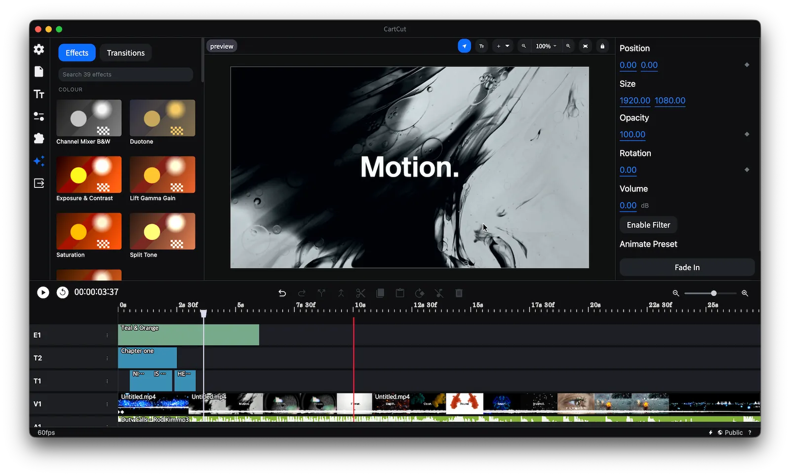

<h1 align='center'>
CartCut
</h1>

<p align='center'>
AI 에이전트를 위한 영상편집 소프트웨어
</p>



<p align='center'>

<a href="#"></a>
&nbsp;
<a href="#"></a>
&nbsp;


</p>

#

<p align='center'>
<a href="../README.md">English</a> | 한국어
</p>

<p align='center'>
<a href="https://www.youtube.com/watch?v=Bh06VOYSMIM">데모 보기</a> · <a href="https://github.com/cartesiancs/cartcut/issues">버그 제보</a> · <a href="https://github.com/cartesiancs/cartcut/releases"><b>다운로드</b></a> · <a href="https://github.com/cartesiancs/cartcut/issues/new">기능 제안</a>
</p>

#

모션 효과와 범용성에 집중한 비디오 편집 소프트웨어입니다.

기본적인 컷 편집, 애니메이션, 사운드 믹싱, 외부 라이브러리 확장, 프로젝트 관리, 텍스트 편집 같은 필수 기능 외에도 강력한 도구들을 폭넓게 제공합니다.

또한 기존의 트랙 기반 편집과는 다른 레이어 기반 편집을 지원합니다. 개별 에셋에 여러 효과를 쉽게 적용할 수 있어 더 유연하고 자유롭게 작업할 수 있습니다.

## 프로젝트 소개

[이 링크](https://demo.nugget.cartesiancs.com/)에서 기능이 제한된 웹 데모를 사용해 볼 수 있습니다.

## 기능

- 컷 편집
- 모든 표준 포맷 지원 (mp4, mov, mp3, wav...)
- 오디오 믹싱
- FFmpeg를 이용한 빠른 렌더링
- 무제한 레이어
- 크로스 플랫폼
- 위치, 크기, 불투명도, 회전 애니메이션 및 키프레임
- 텍스트 추가
- 외부 확장
- 프로젝트 파일 저장 및 불러오기
- 다국어 지원
- 8K, 4K 등 다양한 해상도 편집
- 화면 녹화 및 오디오 녹음
- 크로마키
- AI 자동 자막 (whisper)
- 블러 효과 (WebGL)
- 도형 그리기
- 이펙트 및 트랜지션
- 그 밖에도 다양한 기능

## 설치

먼저 의존성을 설치합니다.

```
npm install
```

그다음 ffmpeg와 ffprobe를 **다운로드**해 `./bin` 아래, 빌드 대상에 맞는 이름의
폴더에 넣습니다. 로컬에서 앱을 실행할 때는 내 컴퓨터에 맞는 폴더 하나만 있으면
되고, `npm run build`는 패키징하는 대상에 해당하는 폴더를 읽습니다.

```
bin/
  darwin-arm64/{ffmpeg,ffprobe}     Apple Silicon
  darwin-x64/{ffmpeg,ffprobe}       Intel Mac
  win32-x64/{ffmpeg.exe,ffprobe.exe}
  yt-dlp
```

호환되는 바이너리는 아래에서 다운로드할 수 있습니다.
https://github.com/cartesiancs/ffmpeg4nugget

macOS 빌드는 반드시 **네이티브** 바이너리여야 합니다. x86_64 바이너리도 Apple
Silicon에서 Rosetta 2를 거쳐 실행되기는 하지만 내보내기 속도가 절반 정도로
떨어지며, 앱은 이를 따로 알려주지 않습니다. `lipo -archs bin/darwin-arm64/ffmpeg`를
실행해 `arm64`가 출력되는지 확인하세요. 또한 빌드에 `libx264`, `libx265`,
`libvpx-vp9`, `prores_ks`와 VideoToolbox 인코더가 포함되어 있어야 하며,
`ffmpeg -encoders`로 확인할 수 있습니다.

다음으로 **권한** 부여가 필요합니다. 아래 명령을 입력해 bin 폴더에 권한을 부여하세요.

`chmod -R 777 bin`

## 실행

```
npm run dev
npm run start
```

## 릴리스

`npm run build:osx`는 macOS 빌드에 서명과 공증을 거친 뒤 GitHub **드래프트** 릴리스로 업로드합니다. 이 드래프트를 게시하면 [`mirror-r2.yml`](../.github/workflows/mirror-r2.yml)이 실행되어 릴리스를 Cloudflare R2로 복사하고, 웹사이트의 다운로드 버튼이 읽는 매니페스트를 갱신합니다.

- `https://download.cartesiancs.com/cartcut/latest.json` — 버전과 Apple Silicon 및 Intel용 `.dmg` URL
- `https://download.cartesiancs.com/cartcut/latest.txt` — 버전만 담긴 일반 텍스트

원본은 GitHub 릴리스이며, 앱 내 자동 업데이트도 여전히 GitHub을 읽습니다. 워크플로가 생기기 전에 게시된 태그를 미러링하려면 `gh workflow run mirror-r2.yml -f tag=v0.5.3`을 실행하세요.

## 로드맵

저희의 궁극적인 목표는 크리에이터가 모션 그래픽을 손쉽게 만들 수 있도록 하는 것입니다. After Effects 같은 무거운 소프트웨어 없이도 멋진 모션 효과를 만들 수 있기를 바랍니다.

자세한 내용은 [로드맵 파일](./ROADMAP.md)을 참고하세요.

## 기여자

 <a href = "https://github.com/cartesiancs/cartcut/graphs/contributors">
   
 </a>

## 라이선스

MIT 라이선스를 따릅니다. [라이선스 파일](../LICENSE)
